# SoftwareCup2024

此仓库为“龙兴启智”团队开发的智教平台项目的代码仓库

## 项目在线地址

[“龙兴启智”智教平台](http://tools.elearninghome.cn:8887/)

## 项目简介

​		本项目是由南京邮电大学-徐竟晗、肖逸、杜小龙三人团队使用星火认知大模型及相关API结合前后端技术开发的一款“提升教师教学效率，减轻学生学习压力”的智慧教育平台。解决2024软件杯A5-基于讯飞人工智能平台数智化教育应用软件开发。

## 项目技术栈

- 前端部分：Vue3、VueRouter、Vuex、Element-Plus、Axios等

- 后端部分：Java、SpringBoot、Python、Flask、MySQL、Redis、Nginx等

- 其他技术：Git、OSS、内网穿透等

## 项目完成主要内容

- 用户通用功能模块：登录、注册、查看/修改个人信息、修改头像**（制作个性化头像）**、退出登录
- 课程信息模块：课程信息分类分页展示，课程详情展示
- 学生功能模块：学生选课、退课、查看选课学习情况**（预测得分）**、学习课程视频
- 教师功能模块: 教师发布课程、查看开课情况**（预测课程热度）**、查看学生学习情况**（预测得分、一键导出）**、作业自动批改
- AI功能模块：AI智能助教、语音翻译、英汉翻译、OCR图片文字识别、PPT自动生成、Latex公式识别
- 项目实现在线部署：前端、Java后端和数据库部署在阿里云服务器，项目在线部署地址：[部署地址](http://tools.elearninghome.cn:8887/)
- 代码开源：项目代码托管在GitHub平台上，地址为：[开源地址](https://github.com/greenhandsxy/softwareCup2024)

## 测试账号

- 学生账号：aaaaaa，密码：aaaaaa

- 教师账号：韩海花，密码：666666

## 项目设置

为使项目可以运行完整功能，需要获取浏览器相关权限，具体作以下设置：
1、使用chorme或edge浏览器打开
2、浏览器网址输入：chrome://flags/#unsafely-treat-insecure-origin-as-secure
3、在第一个高亮输入框中输入：http://tools.elearninghome.cn:8887
4、点击右下角重启浏览器按钮，重启浏览器后完成设置

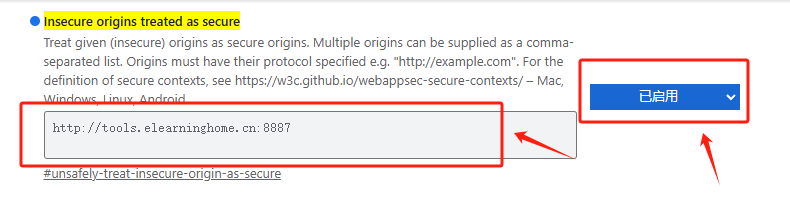

## 文件介绍

- frontend文件夹为项目的前端代码
- backend-java文件夹为项目的Java后端代码，基于SpringBoot框架
- backend-python文件夹为项目的Python后端代码，基于Flask框架
- 课程数据预处理文件夹为从MoocCube数据集中提取对项目有价值的数据，并存入数据库中

## 图片预览

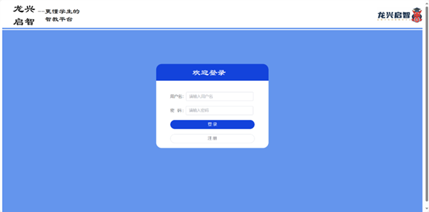

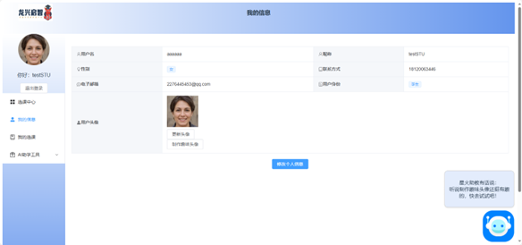

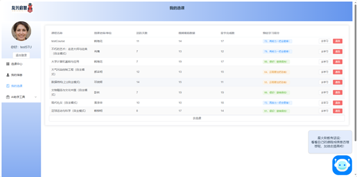

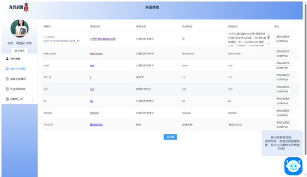

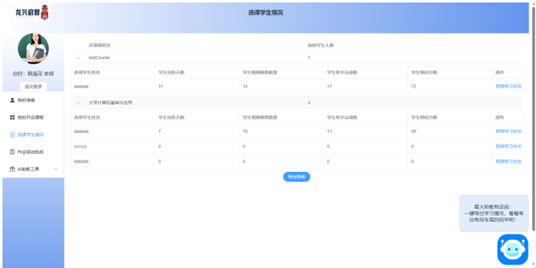

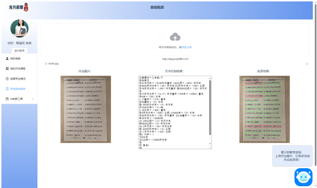

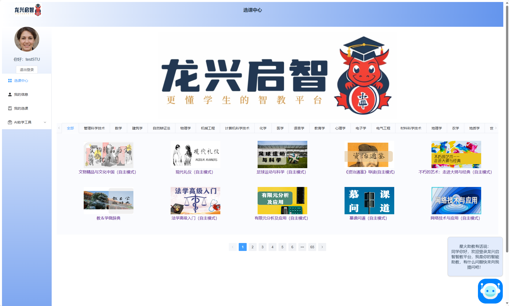

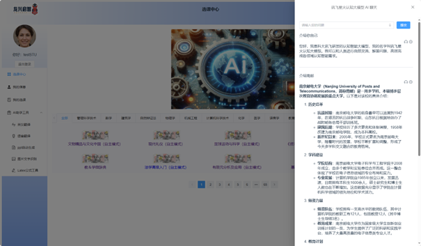

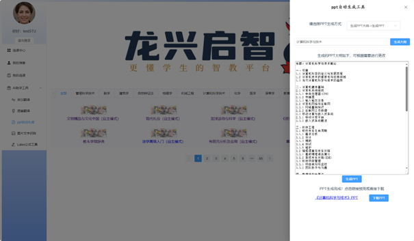

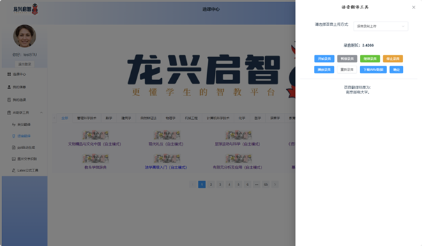